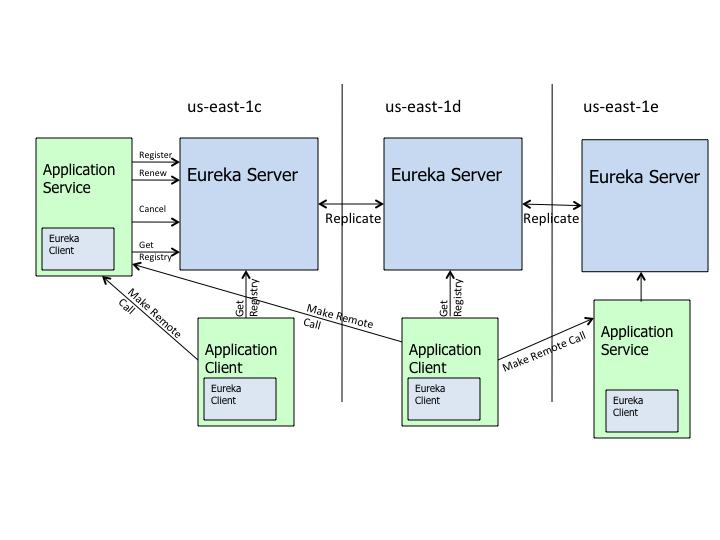

# 个人关于微服务的一些感受
## 通过一个简易的项目入手
### 逻辑架构

### 物理架构

### 部署架构

## Spring Cloud中常见组件以及功能

|组件           | 功能             |
| ------------- |-------------    |
| Eureka        |  服务注册和发现   |
| Ribbon        |  负载均衡        |
| Spring Cloud Config | 服务配置中心  |
| Zuul          |  路由网关        |

### Eureka服务注册和发现
> 服务治理，将服务之间的直接依赖转化为服务对服务中心的依赖

&nbsp;&nbsp;&nbsp;&nbsp;&nbsp;&nbsp;假如把一个项目比做一个班级的话，那么Eureka同学起到的作用：班级内所有事务的处理都需要找Eureka同学获得详细事务对接人，比如同学A需要知道他的语文成绩是多少，于是他就找Eureka同学。
同学A：Eureka同学，我想看下我的语文成绩。
Eureka：我这边所有的事情对应的对接人都在这个名单里面（紧接着Eureka拿出一份名单交给了同学A）
同学A查阅了名单，发现负责查询语文成绩的同学是语文课代表，于是同学A就找到了语文课代表获得了他的语文成绩。

### Ribbon负载均衡

&nbsp;&nbsp;&nbsp;&nbsp;&nbsp;&nbsp;继续故事，过了一阵子，仍旧是Eureka同学和同学A，同学A发现他的语文成绩不对，想找语文老师，但不知道语文老师来了没来。
同学A：Eureka同学，我想看看语文老师来了没来。
Eureka：我这边所有的事情对应的对接人都在这个名单里面（紧接着Eureka拿出一份名单交给了同学A）
同学A查阅名单，发现查看语文老师在不在这个事情有两个人可以做分别是语文课代表和学习委员，由于事情比较急。
同学A第一次问了语文课代表，没有来，第二次问了学习委员，没有来，第三次又问了语文课代表，还没来。。。轮询这两个负责人

### Spring Cloud Config服务配置中心

&nbsp;&nbsp;&nbsp;&nbsp;&nbsp;&nbsp;上面的故事其实是有点缺陷的，缺陷在哪里呢？
我们看负载均衡的这个故事，同学A在拿到名单后，发现查看语文老师在不在的两个对接人-语文课代表和学习委员，但是语文课代表和学习委员是两个职位，负载均衡的场景默认了同学A知道这两个职位对应的具体的人是谁，
但是，实际情况是，对于新同学这两个职位对应的是谁他们是不知道的，也有可能这两个职位会换人，所以我们就需要服务配置中心，这种情况下，服务配置中心中储存了语文课代表是那个同学，学习委员是那个同学，所以同学A一开始就通过Config同学获取了这一对应的信息。

### Zuul路由网关

&nbsp;&nbsp;&nbsp;&nbsp;&nbsp;&nbsp;涉及到路由网关，也就意味着涉及到了项目以外的请求

